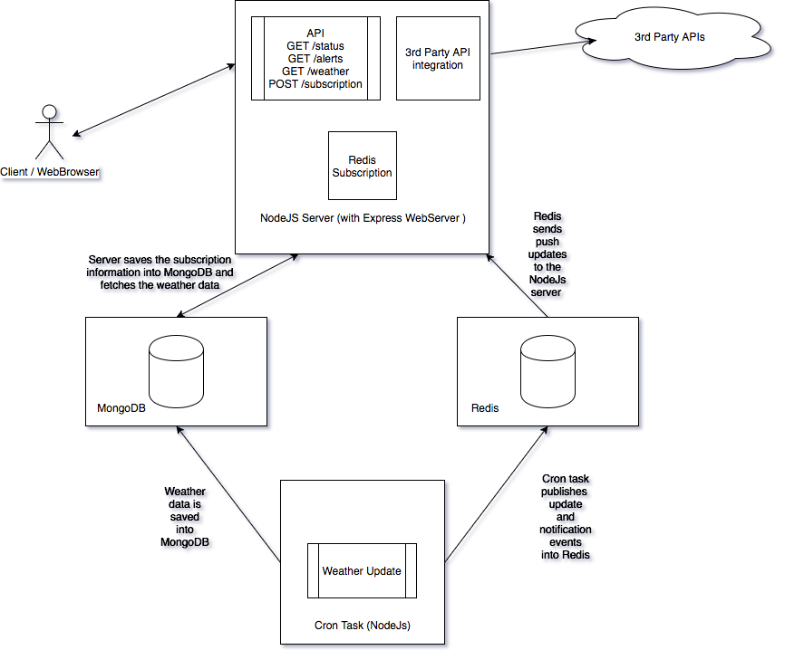

# Weather App

An example application for getting weather information and alerting on temperature breaches. 
The project aims to provide a production ready codebase and architecture to scale the application and a leaner deployment model using Docker.

## Features

- Weather Data integration from [https://darksky.net](https://darksky.net)
- Coordinate (latitude, longitude) locations from [Google Maps Geocoding API](https://developers.google.com/maps/documentation/geocoding/intro)
- NodeJs Server (using ES7) - Express Web Server 
- MongoDB, Redis database integration
- Implementation of schema for mongodb using Mongoose
- Redis Pub/Sub for push updates and notifications
- Cron service for auto update of weather data
- Frontend using [Bootstrap](https://getbootstrap.com) and [VueJs](https://vuejs.org/)
- Docker and Docker Compose integration for One-Click deployment

## Architecture



## Installation

### Requirements

- NodeJs v1.8 or greater
- Docker v17.09 or greater
- Docker Compose v1.16 or greater
- Google API Key
- DarkSky Weather API Key

#### Google API Key

Follow onscreen information about how you can get the API Key from here [https://developers.google.com/maps/documentation/geocoding/get-api-key](https://developers.google.com/maps/documentation/geocoding/get-api-key)

#### DarkSky Weather API Key

Register for a free account and get your key from here [https://darksky.net/dev](https://darksky.net/dev)

**NOTE: There is a limit of 1000 api requests per day with the free account**

### Configuration

The application configuration is placed under _/config.json_ file. Make sure you edit it and add in your API keys.

You can also add some default addresses and subscribe for weather information automatically at bootup.

```json
{
  "server": {
    "host": "0.0.0.0",
    "port": "8080"
  },
  "database": {
    "mongodb": {
      "host": "mongodb",
      "port": 27017,
      "db_name": "weather"
    },
    "redis": {
      "host": "redis",
      "port": 6379
    }
  },
  "google_api_key": "<ADD YOUR GOOGLE API KEY>",
  "weather_api_key": "<ADD YOUR WEATHER API KEY>",
  "subscriptions": [
    {
      "address": "tallinn",
      "alert_min_temperature": 35,
      "alert_max_temperature": 45
    },
    {
      "address": "kolkata",
      "alert_min_temperature": 60,
      "alert_max_temperature": 80
    }
  ]
}

```


### Docker Compose

The best way to run this project is via _docker-compose_.

```bash
docker-compose up
```

The docker-compose command will automatically pull in the required database images and also build the local image for running the web and cron containers. 

The image building is automated at first run only. Hence, if you change something in the codebase then you will need to rebuild the image yourself.

When done you can shutdown the server by running

```bash
docker-compose down
```

### Local NodeJs setup

The application can also be run by executing the following nodejs entrypoints:

1. Installing dependencies - 

```bash
npm install
```

2. Start the MongoDB and Redis database and update the config.json file with the required details.

```bash
docker run -d --name mongo -p 27017:27017 mvertes/alpine-mongo
docker run -d --name redis -p 6379:6379 redis:alpine
```

3. For running the web api server - 

```bash
npm run web
```

4. For running the cron service (via nodejs, hence it runs only once)

```bash
npm run cron
```

### Frontend

The application packs a simple frontend for testing the API features.

The frontend is written in **VueJs** and **Bootstrap 4** and has the following features -

- Fetching weather information for a given address (coordinates are automatically identified from the address)
- Subscribing to a given address with minimum/maximum threshold settings
- Polling (every minute) to get the weather alerts. NOTE here polling is used just for brevity and simplicity. For more architecturally efficient design use Web Sockets or Server Sent Events.  


